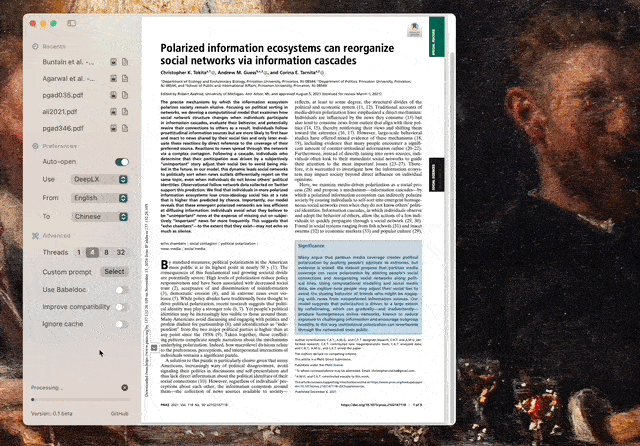

<!--
 * @Author: Rongxin rongxin@u.nus.edu
 * @Date: 2025-04-13 19:09:00
 * @LastEditors: Rongxin rongxin@u.nus.edu
 * @LastEditTime: 2025-04-15 10:50:29
 * @FilePath: /pdf2zh-mac/README.MD
 * @Description: 这是默认设置,请设置`customMade`, 打开koroFileHeader查看配置 进行设置: https://github.com/OBKoro1/koro1FileHeader/wiki/%E9%85%8D%E7%BD%AE
-->
# PDFMathTranslate - Mac Client
Not stable, in alpha.

## Usage
1. Clone the repo
2. Edit the code if you wanna customize the languages etc
3. `swift run`

## Preview

